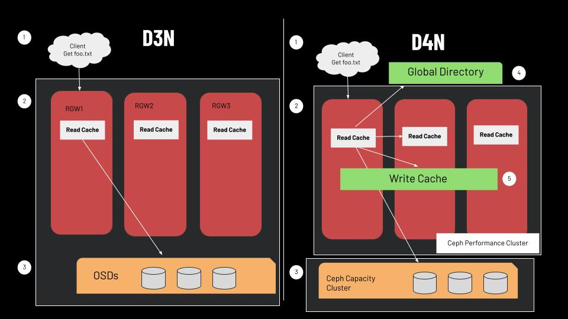

# Accelerating Ceph Cloud Storage with D4N
#### **Team members:** Daniel Paganelli, Khai Evdaev, Mandy Yao, Samarah Uriarte
#### **Mentors:** Ali Maredia, Amin Mosayyebzadeh, Mark Kogan, Matt Benjamin, Emine Ugur Kaynar

---
### How to Run the Code
#### Set Up
1. Ensure your public SSH key has been added to the Ceph2 VM.
2. Add the following to your .ssh config file:
<!-- -->

	Host gateway
		Hostname 128.31.26.122
		User centos
		ForwardAgent yes
	
		#Port 22

	Host Ceph2
		Hostname 192.168.0.106
		User centos
		ForwardAgent yes
		ProxyCommand ssh gateway -A -Y -W %h:%p

3. SSH into Ceph2 through a terminal.
<!-- -->

	ssh gateway # in first terminal
	ssh Ceph2 # in second terminal

#### Program Execution and Testing
4. Navigate to the /home/centos/ceph/build/ directory.
5. Run the full_script.sh script. This script will kill any currently running Ceph clusters, build a new one, follow the D4N caching and directory process, and save all the directory keys, as well as the RGW bucket keys, into two separate files for testing. 
<!-- -->

	./full_script.sh
6. Compile the unit test C++ program.
<!-- -->

	g++ -o unitTest rgw_directory_unitTest.cc
7. Run the unit test executable. 
<!-- -->

	./unitTest
8. Ensure the output confirms the keys match.
9. Kill the Ceph cluster by running the stop.sh script. 
<!-- -->
    
	../src/stop.sh
10. Exit your SSH session.
---

#### Steps to compile build if you made changes to code in ceph/src/
1. Compile src files and create build directory within ceph
<!-- -->

	./do_cmake.sh -DWITH_CPP_REDIS=ON -DWITH_PYTHON2=OFF -DWITH_PYTHON3=3.6
2. Run vstart within /ceph/build/ directory
<!-- -->

	ninja vstart

### Files Modified
#### Directory
- ceph/src/common/options/rgw.yaml.in
- ceph/src/rgw/rgw_common.h
- ceph/src/rgw/rgw_d3n_datacache.cc
- ceph/src/rgw/CMakeLists.txt
- ceph/src/rgw/rgw_directory.cc (ported)
- ceph/src/rgw/rgw_directory.h (ported)
- ceph/src/rgw_directory_unitTest.cc
- ceph/src/vstart.sh
#### Back End
- ceph/src/rgw/rgw_d3n_datacache.h
- ceph/src/rgw/rgw_d3n_datacache.cc
- ceph/src/rgw/rgw_aio.h
- ceph/src/rgw/rgw_aio.cc
- ceph/src/rgw/rgw_d3n_cacherequest.h
- ceph/src/rgw/rgw_d3n_cacherequest.cc
- ceph/src/rgw/rgw_threadpool.h
- ceph/src/rgw/rgw_cache.h
- ceph/src/common/options/rgw.yaml.in
- ceph/src/librados/IoCtxImpl.h
- ceph/src/librados/IoCtxImpl.cc
- ceph/src/librados/librados_asio.h
- ceph/src/librados/librados_cxx.cc
---
### Project Overview
**Ceph** is a decentralized open-source distributed storage system that emerged as a massively scalable storage solution for modern data pipelines to store and streamline important digital information. It is one of the most popular open source distributed storage system. With data volumes growing exponentially, a highly scalable storage that preserves and records digital content for ongoing or future company operations is a paramount solution to any successful business. 

The current version of Ceph is paired with Datacenter-Data-Delivery Network (D3N), a multi-layer cache infrastructure for data centers. Its goal is to speed up performance of big data analytics by caching commonly accessed data on computing clusters connected to a larger data lake. In simpler terms, it utilizes a local read cache to store commonly accessed objects/files. However, there exists a superior caching architecture **D4N** which build upon key features of **D3N** to improve the efficiecy of Ceph. Porting some of **D4N** is the heart and goal of this project.

To actually access stored data in Ceph, one can achieve it in three ways: **radosgw (RGW)**, librados, and RADOS block device (RBD). Our project focuses on Ceph's object storage, which means that the team will only be working with radosgw. Through an RGW, data can be accessed using an HTTP server with the Ceph Object Gateway daemon, which provides interfaces compatible with Amazon S3 and OpenStack Swift. In more simpler terms, Amazon S3 has 3 fundamental functions that a client can use to communicated with an RGW: 
- mb: to make a bucket, which is a directory in S3 language
- put: to upload/put a file/object into a bucket
- get: to retreive a file/object from a bucket

Part of the appeal of an RGW is the ease of use for the user and that was a key design choice by Ceph developers in using Amazon S3.

**Note**: bucket is an equivalent of a directory and object is the equivalent of a file in Linux type file system.

---
### Goals
This project intended to port over some of the key functionalities of D4N into the upstreamed version of Ceph. Compared to D3N, D4N introduces a write-back cache and a distributed directory that allows the program to have an accurate and efficient method of locating cached data on both a cluster’s local cache or on nearby caches based on locality. D4N functions on an old research branch of Ceph, and this project is an attempt to create a Ceph Cluster with the beneficial functionality of D4N incorporated into the modern code base. The team will upstream blocks of D4N code, primarily the directory functionality, into D3N and modify the functions, classes, and pathways to properly implement the directory.

##### Initial Goals
- Make D4N start up in vstart.sh, which is also the orchestration system in the developer workflow that is being followed.
- Work with Red Hat and the research team to select components of D4N and rebase them on master.
- Developing a set of unit tests for each of those components. 
##### Initial Goals That the Team Decided Were Out of Reach 
- Develop documentation and run reviews for newly introduced APIs.
- Performance testing for different synchronization mechanisms.
- Develop testing methodology to raise race conditions of complex distributed systems, e.g., write back while the object is being deleted - develop new interfaces to make race conditions deterministic.
- Integrate testing into Teuthology.

Over the course of the project these goals were revised, largely because they were not precise enough and also to reduce the scope of the project into something more feasible. Plans to test synchronization, race conditions, and other such complex behavior was dropped as implementation goals narrowed. Instead, the team focused on the first 3 goals, as Ceph proved to be a fearsome codebase to grapple with. Instead, the team focused on the first 3 goals, as Ceph proved to be a fearsome codebase to grapple with. 

The modified goal for the directory side of the project became the integration of the directory files and Redis installation alongside unit testing of the setValue() function for the block directory. The block Directory is the reservoir for the metadata of the smaller 4 Megabyte chunks Ceph splits larger data objects into. The final minimum goal for the directory was to integrate their work with the back end functions that would be established by another portion of the project's team members.

The back end portion of the goals narrowed significantly due to difficulties with porting, as will be discussed below. The minimum goal decided approximately two thirds of the way through the project became the implementation and testing of the remote cache get operation, which would allow for a rados gateway to search and fetch data from other rados gateway caches on the same cluster. This functionality was also intended to be integrated with the directory to provide a dynamic, vertically incorporated addition to the Ceph codebase.

---
### Requirements
Virtual Machines were used rather than containers because the latter require more overhead. Additionally, utilizing containers creates unnecessary complications in comparison to the more optimal environment that VMs offer for the purpose of this project. Finally, deploying this system on an OCT is possible but difficult to set up. Working on a VM is analogous to working on a regular host, resulting in this final environment setup.

This project required three separate Virtual Machines (VMs). These machines had the following specifications:

- VM One serves as a gateway and less powerful than its fellow computers. It ran with 4 cores, 8 gigabytes of RAM, and a 64 gigabyte disk and very importantly, had a floating-ip, which meant it could be accessed through the open net.

- VMs Two and Three acted as the Ceph cluster that the teams were modifying. Each VM had 16 cores, 32 gigabytes of RAM, and 250 gigabyte disk. These machines did not have a floating-ip. All three machines were accessed through an OpenStack Terminal. As the project progressed, the third VM was modified in a way as to be nearly unusable with the python scripts the directory team was using. It was deemed easier to create a new VM than attempt to fix the current one. This VM was using the allotted resources of the one it replaced, however.

	

	<strong>Figure 1.</strong> Three VMs should be set up in total, with one acting as a gateway and the other two running the Ceph cluster.

SSDs are not necessary because system performance and development was not being tested. Instead, the local hard disk was used to emulate the SSD and play with the network.

Furthermore, the team used the current Ceph source code as a target to modify the D4N code. The D4N source code is vital to the project and has its own repository. The team’s repository for modifications, improvements, and general work is available here.

---
### Business Value
The result and effort of this project was to begin the porting phase of D4N to Ceph which would in turn be used by the existing Ceph community, which consists of start up companies, research institutes, and large entities such as those that already have used the storage system. Examples of previous users are the University of Kentucky, The Minnesota Supercomputing Institute, and the United States Airforce. As noted in the beginning, Ceph is one of the most popular distributed storage systems.

Users would access Ceph through the client portion of the program and benefit from the caching upgrades of D4N through accessing metadata functions and file I/O.
	
The current cloud computing trend is an increase in the use of cache storage. Implementation of D4N will allow for larger caches that place less pressure on oversubscribed cloud networks. Furthermore, D4N is intended to improve the positioning of data in caches closer to the physical access point, saving on network bandwidth. For a program such as Ceph that is designed to scale nearly infinitely, it is key that the growing distance between clients and servers is addressed.

These are all high level, conceptual benefits to the complete integration of the D4N architecture with Ceph. The accomplishments of this team serve as a baseline to accelerate the integration by more skilled members of the Ceph community. In particular, the merging of the Redis directory was an extremely time-consuming process due to the large number of files that needed to be modified in order to thoroughly implement the new directory files and Redis integration.

---
### High-Level Design
Both D4N and D3N implementations in Ceph make heavy use of SSD or VRAM-based caching. The key limitation of D3N that this project addresses is the inability to access caches that are not part of the local computing cluster.

D4N solves this problem by introducing a directory (a Redis key store) that uses consistent value hashing to place important data in both a network cluster’s local cache and other neighboring caches. Upon a request for a data object’s location from a client, the RGW will access the directory for the data’s key and metadata (e.g. IP address), searching first through the local read cache, then remote read caches for the data, then the write-back cache. If these are all misses, then the program will access the primary data lake.

In our project, the four students were be split into two groups of two students. One team focused on the implementation of the directory in the D3N Ceph cluster. The other group, the back-end team, worked in parallel on the I/O side to ensure that cluster RGW’s can properly interact with nonlocal caches to perform a remote read request from a remote RGWs read-cache. 

The figure below summarizes the ways that a get flow in D4N is different from D3N. The back-end team worked on implementing a remote read request, i.e., the arrows that point to other read caches.

	

	<strong>Figure 1.</strong> Get file flow with D3N and D4N. Note the additions of D4N

Note that D4N also introduces a two-fold cluster division: performance and capacity. Performance represent the SSDs to act as caches. Capacity acts purely as a datalake to store all the objects/files. Enforcing/porting this division was not part of the scope of this project. However, it is important to bear it in mind.

---
### Acceptance Criteria and Accomplished Tasks
The project's initial base goal was to implement the directory functionality from the D4N research code into our upstream Ceph cluster without significantly altering the existing upstream abstractions. We considered our most absolute basic goal to be implementing a get function in D3N that utilizes the directory to find data stored across our Ceph network. Upon getting a get request from the client, the RGW should be able to first search its own local cache and then query the directory to find if the object is in remote caches before finally searching the back end data storage.

Accomplishing this goal would have led into the next set of objectives for the team, which was to implement read and write functionality using the D4N style directory. Implementing these two additional features with the get function is what we considered to be full completion of the project. Overall, the limited scope of our project is due to our intended goal of producing a foundation for later teams to fully integrate D4N into the upstream code. Producing solid, testable code with good practices in mind is more important than implementing as many portions of D4N as possible.

Approximately two thirds of the way through the semester it was recognized that both the integration of the directory and the basic remote get operation were far more complex than expected. Both teams chose to ignore any potential stretch goals such as the remote write functionality. The directory team focused on only getting the D4N directory to compile with D3N, with the intention of hardcoding values later for testing. Similarly, the back end team decided with mentor support to focus exclusively on getting a remote cache get operation completed, using their own set of hardcoded values to negate the need for the directory.
	
Ultimately the team as a whole saw mixed success, with a definitive failure to meet the minimum viable product. The directory team was the most successful and was able to compile Ceph with the D4N directory and connect it to a functional Redis key value storage. Additionally, the setValue() function for cache block objects was implemented and underwent preliminary testing. The directory team did not have enough time to implement the more complex distributed system tests that were part of the initial goal, but we consider the work done by the directory to have achieved their revised goals.

The back end team saw less direct success. The entire function stack required for remote get operations from a nonlocal RGW was implemented in the upstream Ceph get function. However, we were unable to debug the function by the end of the project, leaving us without an end-to-end product. In addition, late discussions with the mentors found that some of the added code did not adhere to upstream Ceph's refactored namespaces, which means that the existing back end code does require more than just debugging before it can be considered an accomplishing of the minimum viable product. We consider our acceptance criteria not met, though we and our mentors believe we made significant progress in spite of that.

---
### Lessons Learned
Failure is an excellent teacher, which we learned quite quickly, as this project was hampered by setbacks and failures alike. For many members of the team, this was the first time working with a very large codebase and a very poorly commented one at that. 

**Environment Set-up**: The first hurdle, which took well over 4 weeks in total, was setting up the environment for Ceph. None of the team had much experience with working with VMs either, so we were taught by our mentors how to modify our own machine's configs to SSH, how to download Ceph onto the VMs, and how to boot it up. Then, we had to learn the commands relevant to Ceph and how to use the bash terminal quickly and efficiently, which was a new experience for at least one member of the team. Using the terminal well turned out to be a vitally important skill for the back end team when it came to porting, as will be discussed later. This was also the first major use of Git for at least one team member.

**Git**: Git deserves its own moment of elaboration. It's an extremely useful tool that has a steep learning curve, which led to a large amount of consternation on the team. At one point during Sprint 4, the .git file was deleted on the first VM, leading to about 4 days of wasted time. The reason for this deletion was an attempt by one team member to get their pushes and commits to function properly, having never used Git in a meaningful way. After that event, the whole team was more dedicated to proper Git usage and managed to deal with most issues that arose regarding the tool in an efficient manner. Usage of the Git log and commits was vital to porting code between Ceph1 and Ceph2 as well as the reverting of catastrophic coding mistakes. If there is anything to take away in hindsight from this project, it would be to utilize Git even more than what we did during the project. The team barely touched many of Git's more esoteric commands and a more regular commit schedule would have saved time when a team member wanted to revert a minor modification that caused unexpected errors. 

**Debugging**: The primary ones used for this project were GDB and Ceph's internally implemented log. Often, debugging is a simple process of placing printout statements throughout the code and figuring out which ones don't get reached, but that is an invalid strategy for a program as large as Ceph. Utilizing the log of Ceph is like printing out statements to the terminal but requires the usage of more ornate systems and was only really helpful when the statements were coupled with a relevant variable.

**Bash/Terminal**: Usage of the terminal was a fundamental skill that received a great deal of training. Though a simple skill, it was fundamental to traversing the VMs and for finding what to port next in the jungle of code that is Ceph. Memorizing the list of Linux and GDB commands, as well as their permutations, was key to allowing the back end team to find bits of code to port. Where and when to grep for a string, for example, was a nuanced balance between choosing a high-level directory for coverage and a lower directory for speed. Other related skills that the team utilized in this vein was how to modify config files for SSHing and remote connections and the technicalities behind directory pathing for include headers.

So far, these are all technical lessons, which, while important, can be learned in a bog-standard coding class. Other lessons were peculiar to this project and would not have been easily learned from a class.

**Handling Complex/Large Code**: The unique lessons Ceph taught came from its complex nature and large size. A key example of this was the need for minor, iterative improvement over the course of the project. Initially, it was enticing to attempt to port entire functions at once, a method that led to impossible to parse error messages. A better alternative was to start with only the header of the function and then chunks at a time, a rhythm that allowed the team to add multiple functions and classes per day rather than fumbling around all day with only one. If anything, the back end team became somewhat over-fixated on porting the flow top to bottom in this efficient manner. This created issues at the end of the project where the mentors noticed that the ported remote get operation was using a depreciated abstraction of the RGW, and the single-minded focus on efficient porting left the team unsure of where to revise the code to fit into the upstream structure more accurately. In the future, we must be mindful on when to port wholesale and when to recognize when something must be inserted more deftly, rather than focusing on output.

**Large Profram Flow**: How to manage large program flow? For some of the team members, this was the first time a program had more than two levels of functions. A GDB backtrace on the remote get function we ported revealed 18 functions on the stack. As we ported and modified portions of the code, we had to ask ourselves when and where we could pass arguments from the top of the chain, whether the structure whose function we were calling had the fields we wanted, and where we wanted to put new log statements for efficient debugging. 

**Team and Mentors**: Our team and our mentors started the project with very high hopes and did not fully settle on a singular goal until several weeks into the project. By then, we began to realize that Ceph was more difficult to modify than anyone first thought, and we had to prune back our goals. We had to ask, “What do we think is actually possible, based on what we have achieved so far? Where are the parts of this code that we can break into smaller deliverables?” We eventually settled on the compiling and running of the directory and the remote get function, but even those had some features in the air. Could we get an end-to-end product complete? If so, are we sure we know the entirety of what that entails? These are the hard questions that we learned to ask, and it led to modest final goals of the project. Even then, we see, as a group, a few places where we could continue to improve. Our sprints lacked the ideal "vertical slice" deliverable user story that was defined as the ideal at the start of the semester. For much of the project after we pared down our goals, we felt that we couldn't get smaller than the get function. However, as noted above, the get function was comprised of many nested functions. Attempting to get each one to work properly rather than setting the get function as the goal for each sprint may have helped us with the debugging issues at the end of the project, where we ran into a complex infinite loop that resulted in a segment fault. Because we ported all of get before major debugging, this complex bug was too difficult to solve in time.

**Cloud**: Lastly, this is afterall a cloud computing course and we were dealing with cloud hands-on throughout the whole semester.
- Ceph is a distributed cloud storage system that runs on cloud
- Amazon S3 is an http based object storage service that runs on cloud
- The actual environment that we ssh'ed into were part of MOC (the cloud)
Reading about cloud is one thing, working on it is completely different. All the members of the team came out with a better understanding and a more superior experience with the cloud as a result of working on this project.

---
### Limitations of the Project
A few of the challenges that arose during the project are worth noting. The first is the sheer difficulty with working with such a large body of code. It took an hour for the directory team to recompile their code after any modifications and the size and complexity of the code meant that each improvement required many small changes. Additionally, the VM and Ceph environment setup took the team two sprints, due to a mix of the elaborateness behind all the various setup phases and the novice nature of the team.

This project was the first time that many of the team members had ever dealt with this large a codebase. Furthermore, the overwhelming majority of Ceph files lack comments, which made it more difficult to understand the purpose behind various functions and structures. Especially regarding the back end, the team spent a great deal of time trying to study the code, limiting the time to actually port it. Even after porting the code, the back end team still felt the absence of a thorough understanding of the software, leading to an inability to efficiently debug. If we were to take another look at this project, the team agrees that more hands-on testing of the functioning upstream and D4N code prior to porting would have helped us understand how to merge the two code bases, rather than the more abstract studying we did.

The final logistical challenge of the project was communication among the team and mentors. Our mentors were superbly knowledgeable about our tasks and Ceph but also specialized in this regard, and, for the most part, each mentor knew the intricacies of upstream Ceph or D4N, but not both. It was difficult to schedule times where the entire team and mentors could meet, which led to some confusion on goals and differences in functionality. Our team began to improve at communication by the end of the project with large group emails, but we could have done better from the start on keeping everyone on the same page.

---

### Future for the Project
The most promising path forward for this project is the continued integration of the D4N-style directory. Integrating the full setValue() function for the object directory is the most immediate next step, which should not prove to be a serious challenge considering the successful addition of the block directory's setValue() function. Following this would likely be the application of the getValue() functions for both block and object metadata, and beyond that, the rest of the directory's functionality should be achievable using the foundations set in this project.

The ideal but long-term goals behind D4N include establishing the get, read, and write functions for the write-back cache, remote back ends, and remote RGW caches. The progress made over the course of this project towards these goals is mixed, as the implemented code for the back end get call to a remote RGW cache is complete from D4N, but nonfunctional. It will require additional cleanup to both operate and fit closer into the upstream Ceph dataflow for requests. Both the team members and the mentors for the project have expressed interest in continuing the project in order to see this part of the D4N implementation through.

Overall, we believe that the work completed in this project is beneficial to the larger Ceph community and we are proud to have contributed to a significant open source project, a first for many of the team members. Though no official plans exist yet, it is likely that the team will continue the project past the end of the fall 2021 semester.

---
### Demos
##### **Demo 1 Video Link:** https://drive.google.com/file/d/1gHP5dZ80w4Xn2DuMSbVdR6eSDQE3XQXG/view?usp=sharing
##### **Demo 2 Video Link:** https://drive.google.com/file/d/1zKDpXfYASGvzWEACVdQuIBRUEwI-7-e-/view?usp=sharing
##### **Demo 3 Video Link:** https://drive.google.com/file/d/1NHp9ZXcn3JnY5Y3MF-aR02Azp3Jncu15/view?usp=sharing
##### **Demo 4 Video Link:** https://drive.google.com/file/d/1KU6O83Lgywgxp9eTMnjkICGFwyoUqH21/view?usp=sharing
##### **Demo 5 Video Link:** https://drive.google.com/file/d/1I4-euIcDG7HwzjdCYVZP6ByjGJuRb2hM/view?usp=sharing
##### **Final Video Link:** https://drive.google.com/file/d/1rhcgfiU-IUKM47MQRwPc2DkO7Ep4fX3Q/view?usp=sharing
---
### Sprint Breakdowns
#### Sprint 1 (September 27 to October 10)
| User Stories | Description |
| ----------- | ----------- |
| Research relevant technology and concepts | This user story involved us reading papers on Ceph and the technology it uses, such as D3N, RADOS, Redis, S3, etc to obtain a higher comprehension of what we would be working with. |
| Understand code | After meeting multiple times with our mentors and reviewing current github implementations of the codebase, we have gained a better understanding of both the D3N and D4N variations and how they are established in Ceph. |
| Environment setup | Our mentors provided us with the environment requirements that we needed to request from the professors and, after doing so, we ensured each team member had the correct permissions to access these requirements. |
| Create local Ceph cluster | We successfully cloned the Ceph github repository in both VMs and ran emulations of a Ceph cluster to ensure it has been set up properly. |
| Complete sprint 1 demo | Through various meetings with our mentors, we achieved a better understanding of the project itself as well as the work we will be focusing on throughout the course of the semester. This user story was mainly administrative, however, necessary to set up the foundation we will be building our understanding off of further along the semester, allowing us to establish a standard of organization to follow as well. We set up our project on Taiga and proceeded to record the first demonstration of the progress we have made thus far. |

#### Sprint 2 (October 11 to October 24)
| User Stories | Description |
| ----------- | ----------- |
| Set up team logistics | Our project required the workload to be split into two distinct groups. We assigned ourselves to the group we preferred and set up meeting times with our mentors to establish the next steps. |
| Understand "get" functionality | Members met with one of our mentors to work with D4N's "get" functionality and develop a deeper understanding of it. |
| Become familiarized with Ceph environment | Our mentors showed us how to navigate the Ceph environment and interact with the technology we would be working with. We practiced performing these operations on our own to ensure we were comfortable with doing so. |
| Explore D3N on Ceph VMs | We were able to learn how to put objects into, as well as get them from, the D3N cache. This allowed us to confirm the cache was working as expected and that we would be able to utilize this functionality in our future work. |
| Complete sprint 2 demo | In addition to discussing the professors' feedback for our first demo amongst ourselves and our mentors, we decided what functionality we would show and how we would format the overall video. We did not keep Taiga's representation of our work up-to-date and so we learned to ensure we do this in future sprints. |

#### Sprint 3 (October 24 to November 7)
| User Stories | Description |
| ----------- | ----------- |
| Git setup | The original repository we were working on was not forked from Ceph, which would potentially create issues in the future. As a result, I forked the original Ceph code under our organization and pushed all the progress we have made thus far. |
| Get() directed acyclical graphs | The back end team completed DAGs for both the D3N and D4N get() functions in addition to finding the head object's data path for D4N. |
| Initial set up and understanding of directory | To set up D4N functionality in the current Ceph version built onto our VMs, we had to cherry pick D4N-related commits,  install Redis and start it up, and analyze the D4N code for a better understanding of how it works. |
| Directory porting | This user story mainly included porting the rgw_directory.cc and rgw_directory.h files into the Ceph directory and adding the former into the CMake file. |
| Back end | Like the directory porting user story, the back end team worked on porting specific D4N files to the upstreamed Ceph available on VM 1 and is working on debugging the build process. |
| Beginning of testing phase | The directory team finished their tasks for this user story, which consisted of creating a write-up with descriptions of each rgw_directory.cc function and meeting with the mentors to set up unit testing steps, practices, and the environment we would be using to test, namely, boto3. |
| GDB debugging | The back end team met with one of the mentors in order to finish the execution portion of this user story in the following sprint. |

#### Sprint 4 (November 8 to November 21)
| User Stories | Description |
| ----------- | ----------- |
| GDB debugging | The back end team learned how to use GDB to follow Ceph functions during their execution, which provided them with a deeper understanding of the relationships between the functions underlying D3N and D4N. |
| Understand D4N setup | This user story was mostly completed in sprint 3, but it was added to sprint 4 for us to fully finish. The teams familiarized themselves with the D4N environment and started keeping logs of any errors that resulted from attempting to build Ceph. |
| Resolve directory D4N porting issues | This user story included looking through the D4N files and comparing it with the analogous D3N files to add proper configurations and definitions to the upstreamed Ceph code that D4N relies on. In particular, the files rgw.yaml.in and rgw_common.h were altered and doing so allowed the radosgw binary to be built. Additionally, D4N was determined to be fully functional in VM2. |
| Make and build | The back end team is waiting on the directory team to make the ninja vstart command fully functional, as this would mean D4N has been added to Ceph. The former can then start working on I/O directing and the latter can begin testing the D4N functionalities to ensure they are present in Ceph in the next sprint. This task wasn't finished in this sprint, so it was ported over to the next one. |
| Back end | The tasks under this user story were not completed due to the corresponding team discussing their progress with the professors and being advised to reconsider how they will achieve their MVP. Instead, the goal has been changed to rethinking the path the back end team will take to move forward. |

#### Sprint 5 (November 28 to December 15)

| User Stories | Description |
| ----------- | ----------- |
| Debugging directory functionality | After porting the D4N directory functionality to upstream Ceph and adding hardcoded values to the D3N libaio write callback function, we ran into errors when attempting to get an object that was put in a bucket we made. S3 was refusing to connect, and so our mentors advised us to use GDB to look through the stack. We saw that there was a segmentation fault and it was due to our attempts to log the hardcoded values to ensure consistency. After figuring this out, our mentors provided us with next steps that allowed us to solve this issue. |
| Compilation error (continued) | This is a continuation of the previous user story with more detailed tasks that follow the process of setting up D4N and attempting to use the directory. After finishing these first two user stories, our mentors were additionally able to build off our work to dynamically update directory values rather than relying on the hardcoded values we were manually testing the directory functionality with. |
| Directory unit testing | The directory team wrote a C++ program to unit test the dynamic values that the directory function was upgraded to incorporate. This program opens two text files that contains the RGW bucket keys and the metadata available in the directory, ensuring the entries match and the block number correctly corresponds to the object size. |
| Testing of D4N in upstream Ceph | After writing the unit test, the directory team added code to create the separate key files that are to be compared and to execute it in a shell script. |
| Set up demo environment | The back end team set up a multi-RGW Ceph cluster to demonstrate the new get functionality for demo 5. |
| Porting submit get request logic | This task includes merging the back end and directory team's work and ensuring all the functionalities of D3N and D4N are kept. This user story was completed and although the back end team was unable to implement all desired features of D4N, the merged code compiles and successfully runs the directory process. |
| Hardcode get request values | This user story was created by the back end team to test their work. The tasks included hardcoding cache block and object data and modifying the RGW yaml file, which was completed. However, the goal for this user story went unfinished due to various difficulties that the team did not have time to fix. |

---
### Resources
1. Batra, Aman. “D4N S3 Select Caching and the Addition of Arrow Columnar Format.” YouTube, YouTube, 7 Aug. 2021, https://www.youtube.com/watch?v=X4-s978FCtM.
2. CS6620-S21. “CS6620-S21/D4N-s3select-Caching.” GitHub, https://github.com/CS6620-S21/D4N-S3Select-Caching.
3. “Current Projects.” Current Projects - MOC Documentation, https://docs.massopen.cloud/en/latest/home.html#openstack.
4. DeCandia, Giuseppe, et al. “Dynamo: Amazon’s Highly Available Key-Value Store.” All Things Distributed, Association for Computing Machinery, 14 Oct. 2007, https://www.allthingsdistributed.com/files/amazon-dynamo-sosp2007.pdf.
5. Howard, John H., et al. “Scale and Performance in a Distributed File System .” Carnegie Mellon University School of Computer Science, ACM Transactions on Computer Systems, Feb. 1988, https://www.cs.cmu.edu/~satya/docdir/howard-tocs-afs-1988.pdf. 
6. E. U. Kaynar et al., "D3N: A multi-layer cache for the rest of us," 2019 IEEE International Conference on Big Data (Big Data), 2019, pp. 327-338, doi: 10.1109/BigData47090.2019.9006396.
7. Mosayyebzadeh, Amin, et al. “D4N: Directory Based D3N.” https://docs.google.com/presentation/d/1FiEtu3biXWdSehOekR1VGr6B6AWvRtauWu0j6KL5u-I/edit#slide=id.p. 
8. “OpenStack Tutorial Index.” OpenStack Tutorial Index - MOC Documentation, https://docs.massopen.cloud/en/latest/openstack/OpenStack-Tutorial-Index.html.
9. Platz, Carol. “Ceph Storage [A Complete Explanation].” Lightbits, 3 Sept. 2021, https://www.lightbitslabs.com/blog/ceph-storage/.
10. Request a Project.” Mass Open Cloud, https://massopen.cloud/request-an-account/.
11. Weil, Sage A., et al. “Ceph: A Scalable, High-Performance Distributed File System.” Storage Systems Research Center, USENIX Association, Nov. 2006, https://www.ssrc.ucsc.edu/media/pubs/6ebbf2736ae06c66f1293b5e431082410f41f83f.pdf.
